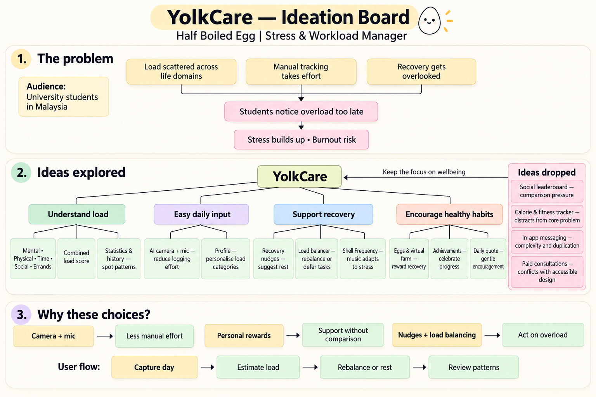
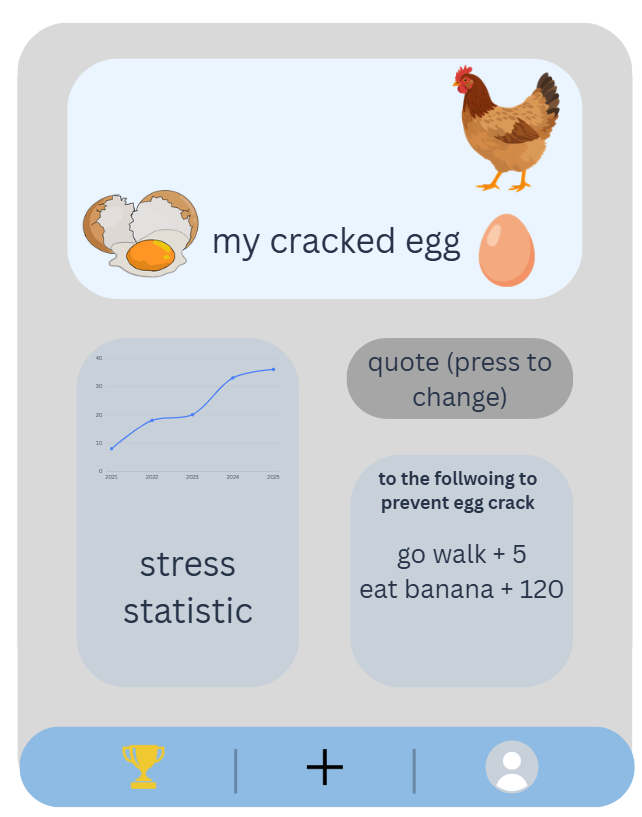
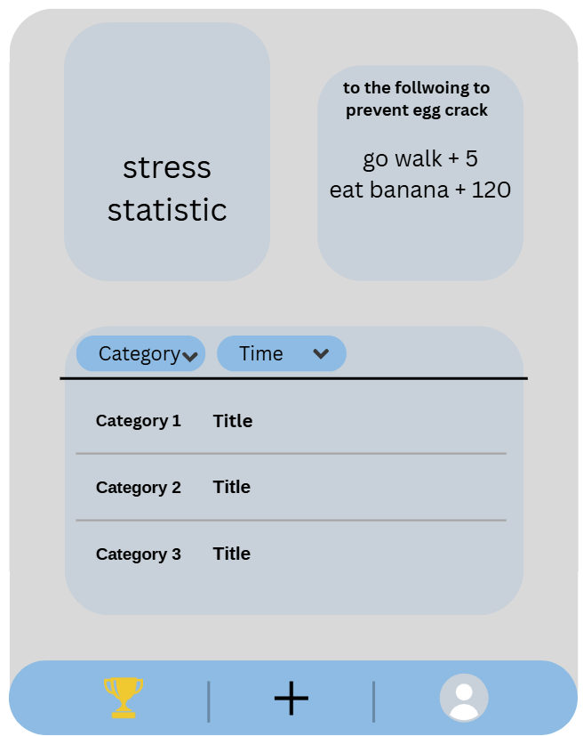
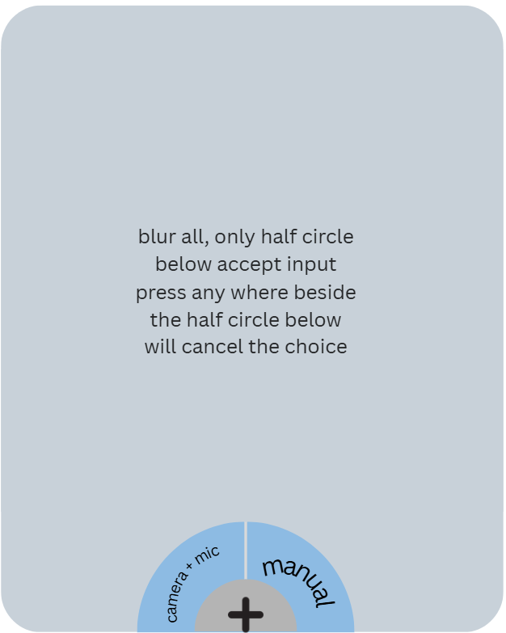
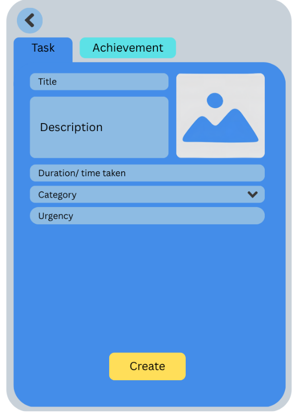
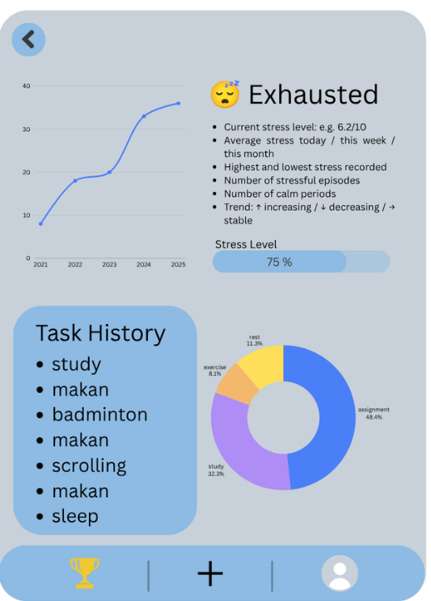
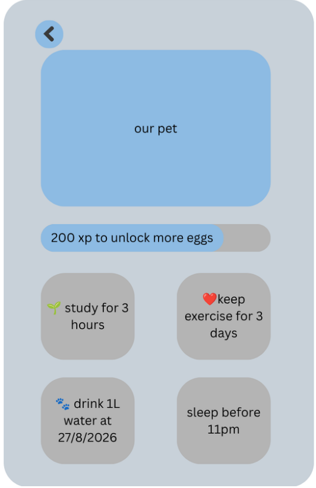

# YolkCare by Half Boiled Egg

__Team members:__ Gordon Liew Yew Yang, Marilyn Emah Sim Mei Lim

__Problem Statement:__ Stress & Workload Manager

__Video Presentation:__ [link_to_video]()

__Presentation Slides:__ [link_to_slide](https://canva.link/pxswkba4l6xdmlm)

---

## 1. Project Overview

### The Problem

University students burn out not from one thing, but from everything piling up across assignments, jobs, errands, and social life simultaneously — with no way to see the total weight until it's too late. Load is fragmented across five life domains with no unified view, there's no early warning signal so students only react after burnout hits, manual tracking is too high-friction to maintain under pressure, and recovery is never treated as a real priority. The key stakeholders are university students in Malaysia. Apps like Finch gamify self-care but never model actual load or capacity, Todoist and TickTick handle tasks well but are completely blind to physical and social strain, and Daylio only reflects past mood with no ability to predict or intervene — none of them give students a unified, proactive view of how much they're truly carrying.

### Our Solution

YolkCare is a mobile app that gives university students a real-time picture of how much they're carrying across mental, physical, time, social, and errand load — before burnout hits. Instead of manual logging, students report their day through AI-powered camera and mic input, keeping the friction near zero. Algorithms then calculate total load across categories and surface smart suggestions to rebalance, defer, or recover.

---

## 2. Ideation & Process

### 2.1 Ideas We Considered

| Idea | Keep / Drop |
| :-- | :-- |
| Achievement Board | ✅ Keep — Reinforces progress visibility and motivates students to maintain healthy habits over time |
| Virtual Farm (YolkCare Eggs) | ✅ Keep — Ties recovery and stress management to a rewarding, low-stakes mechanic that fits the team identity and keeps students returning daily |
| AI Camera + Mic Input | ✅ Keep — Directly solves the friction problem that kills every manual tracker; core to what makes this app different |
| Shell Frequency | ✅ Keep — Adapts background music to the user's current stress level and workload, creating an ambient emotional response without requiring any action from the user |
| Statistics & History Panel | ✅ Keep — Lets students spot patterns in their load and stress over time, turning short-term data into long-term self-awareness |
| Profile Panel | ✅ Keep — Grounds the experience in personal context and allows customisation of load categories to fit each student's lifestyle |
| Daily Quote | ✅ Keep — Low-effort, high-warmth touchpoint that nudges students to open the app daily without adding cognitive load |
| Social Leaderboard | ❌ Drop — Comparing stress loads publicly creates social pressure and could shame students who are already struggling |
| Calorie & Fitness Tracker | ❌ Drop — Scope creep; physical load is already captured through AI input and a dedicated fitness tracker pulls focus away from the core burnout problem |
| In-App Messaging | ❌ Drop — Adds significant development complexity and duplicates what messaging apps already do better |
| Paid Stress Consultation Booking | ❌ Drop — Introduces a monetisation layer that conflicts with the app's accessible, student-first positioning |

### 2.2 Idea Evolution

YolkCare started as a straightforward stress logger — a form-based input where students manually rate their load across categories at the end of each day. The first pivot came when we recognised that manual entry is the exact failure mode of every existing app; students who are overloaded are the least likely to open a form and fill it in. This led to the AI camera and mic input as the core input mechanism, shifting the app from a tracker to a reporter. The second evolution was the reward system — the virtual farm and achievement board were added after realising the app needed a reason to return daily beyond utility alone, which is where the Half Boiled Egg team identity and the egg-themed mechanic emerged. Shell Frequency was a late addition, recognising that passive ambient feedback (music) could carry emotional load information without demanding any interaction at all.

### 2.3 Ideation Boards

#try testtt

  

    <!-- Centre -->
    

      How to Manage Stress
    

    <!-- Top left -->
    

      Ample Sleep
    

    <!-- Top centre -->
    

      Play Games
    

    <!-- Top right -->
    

      Good Time Management
    

    <!-- Right -->
    

      Dance & Sing in Shower
    

    <!-- Bottom right -->
    

      Eat Good Food
    

    <!-- Bottom centre -->
    

      Drink Enough Water
    

    <!-- Bottom left -->
    

      Music ♡
    

    <!-- Connector lines -->
    <svg
      width="700"
      height="500"
      style="position:absolute; top:0; left:0; z-index:-1;"
    >
      <line x1="285" y1="210" x2="150" y2="75"
            stroke="#777" stroke-width="2"/>

      <line x1="350" y1="190" x2="350" y2="70"
            stroke="#777" stroke-width="2"/>

      <line x1="430" y1="210" x2="590" y2="115"
            stroke="#777" stroke-width="2"/>

      <line x1="450" y1="250" x2="620" y2="250"
            stroke="#777" stroke-width="2"/>

      <line x1="420" y1="300" x2="560" y2="400"
            stroke="#777" stroke-width="2"/>

      <line x1="350" y1="310" x2="350" y2="435"
            stroke="#777" stroke-width="2"/>

      <line x1="280" y1="300" x2="150" y2="390"
            stroke="#777" stroke-width="2"/>
    </svg>

  

#### 2.3.1 Home Page

  
  

Provides an overview of the student’s wellbeing through a virtual egg whose condition reflects their stress level. Students can tap the egg to access the Virtual Pet Centre or select the stress chart to view detailed statistics. The page also displays an editable daily quote and suggested recovery activities, such as taking a walk. The bottom navigation provides access to achievements, task entry, and the user profile.

Scrolling down reveals a task list with category and time dropdowns for filtering tasks. The list initially displays the three latest entries, with further scrolling allowing students to view more. Selecting a task opens its details, making it easier to review recorded activities and understand what contributes to their workload.

#### 2.3.2 Task Entry Page

  

Opens a semicircular input menu with two options: AI-assisted camera and microphone logging, or manual entry. The camera and microphone option allows students to show or describe an activity for AI to interpret and record as a task or achievement. The manual option opens the entry form. The background is blurred while the menu is active, and tapping outside the semicircle closes it.

#### 2.3.3 Entry Page

  

Provides a form for creating or editing a task or achievement, with tabs to switch between the two entry types. Students can enter a title, description, duration, category, and urgency, as well as attach an image. These details help capture the activity and its workload requirements. The button displays “Create” when adding a new entry and “Save” when updating an existing one.

#### 2.3.4 Statistic Page

  

Helps students review their stress and activity patterns through a trend chart, current stress status, and stress-level indicator. It summarises average, highest, and lowest stress levels, along with stressful episodes and calm periods. A task history lists recorded activities, while a doughnut chart shows their distribution across categories. Students can access more task history and enlarge the category chart for a closer look.

#### 2.3.5 Achievement Page

  

Displays the student’s virtual pet and an XP progress bar showing their progress towards unlocking more eggs. Achievement cards highlight healthy habits and milestones, such as exercising regularly, staying hydrated, and sleeping earlier. The page also includes AI-generated load-balancing suggestions to encourage recovery. Completing achievements earns XP, helping students stay motivated to maintain healthy routines and manage stress.

### 2.4 Mentor Consultation

| Date | Mentor | Feedback Received | What Was Changed |
| :---: | :---: | :--- | :--- |
| 12th September 2026 | Zach Khong | We are penguin egg instead | Eat more |

---

## 3. Design & Prototype

__UI Prototype:__ [View on Canva](https://canva.link/xjfs6m4h9synss4)

__Backup Link:__ [link_to_backup](https://drive.google.com/file/d/1y-6P84RnBb1Dgqm8ZLu-LvBEnn6eXVbE/view?usp=sharing)

---

## 4. What Makes It Different

YolkCare isn't another mood journal or task manager — it's the only student-focused tool that unifies load across five life domains and acts on it before burnout hits. Here's what sets it apart:

| Feature | The Twist |
| :--- | :--- |
| AI Camera + Mic Logging | No other wellness app lets you report your day by just talking or pointing your camera — eliminating the friction that kills manual tracking habits |
| Multi-Domain Load Calculator | Most apps track one dimension; YolkCare weighs mental, physical, time, social, and errand load together into a single capacity score |
| Proactive Recovery Nudge | Instead of just showing data, the app tells you when to stop — suggesting rest, downtime, or a hangout before you hit the wall |
| Load Balancer | Automatically groups and defers lower-priority tasks when capacity is high, so the app doesn't just warn you — it helps you respond |
| Shell Frequency | Background music shifts in real time based on your current stress level and workload — calm lo-fi when you're balanced, gentle ambient when you're overloaded — so the app feels the pressure with you |
| Egg & Farm Reward System | Recovery and stress management are tied to a playful virtual farm mechanic, making rest feel like a win rather than lost productivity |
| Burnout-First Design | Every feature is built around one goal — catching overload early — rather than maximising productivity like most competing tools |

**Scalability:** YolkCare is built for Malaysian university students first, but the load model and AI input mechanism are not institution-specific. The same architecture could be extended to secondary school students, young working adults, or licensed to university counselling centres as an early-intervention dashboard — without rebuilding the core.

---

## 5. Technical Architecture & Feasibility

### Tech Stack

YolkCare is a self-contained Android app with no multi-user sync or server-side logic required, so a lightweight local architecture is the right fit for this scope.

| Layer | Technology | Why | Constraint |
| :--- | :--- | :--- | :--- |
| UI | Jetpack Compose | Modern declarative Android UI, native to Kotlin and well-suited for dynamic dashboards and animations | Android only; no iOS support |
| Architecture | MVVM (ViewModel + LiveData) | Clean separation of UI and business logic, natively supported in Jetpack; keeps the codebase maintainable | Requires discipline to keep ViewModels focused and not overloaded |
| Local Database | SQLite via Room | Built into Android with zero setup cost; ideal for storing per-user load history, stress logs, and task data on-device | Data is local only — no cross-device sync or backup unless added separately |
| AI Multimodal Input | Gemini API | Handles both camera and mic input in a single API; free tier is sufficient for prototype scale; integrates naturally with Android | Requires internet connection; API key must never be bundled into the APK |
| Speech-to-Text | Google Cloud Speech-to-Text | Accurate transcription with Malay and English support; free monthly quota fits demo-scale usage | Requires internet; API key should be handled server-side or via a secure proxy to avoid exposure |

### System Architecture

The app follows the **MVVM (Model–View–ViewModel)** pattern throughout:

- **View** — Jetpack Compose UI screens that observe state from the ViewModel
- **ViewModel** — handles all business logic including load calculation, suggestion generation, and API calls
- **Model** — Room database for local persistence; Gemini and Google STT APIs for AI-powered input processing

### Deployment

The app is distributed as a direct APK install onto a physical Android device running **API level 26 (Android 8.0) or above**, which covers the majority of mid-range devices in use today. No Play Store submission is required for prototype demonstration.

### Build Plan & Scope

The team consists of two members. The prototype phase runs 7–13 September, with submission on 13 September. Tasks are front-loaded to leave buffer time before the deadline.

| Phase | Focus | Target Completion |
| :--- | :--- | :---: |
| Phase 1 | Core UI screens — home dashboard, load input, history panel | 9 Sep |
| Phase 2 | AI camera and mic integration via Gemini API | 10 Sep |
| Phase 3 | Load calculator algorithm and category scoring | 11 Sep |
| Phase 4 | Virtual farm mechanic and achievement board | 12 Sep |
| Phase 5 | Polish — daily quotes, recovery nudges, Shell Frequency, profile panel | 13 Sep |

**Resource awareness:** The team is two people working within a one-week prototype window. All technologies chosen are either free (Room, Jetpack, MVVM) or on a free tier sufficient for prototype scale (Gemini API, Google Cloud STT). No cloud hosting cost is incurred as the app runs locally on-device. The primary constraint is time — API integration and the load algorithm are the highest-risk tasks and are scheduled earliest to allow recovery time if issues arise.
